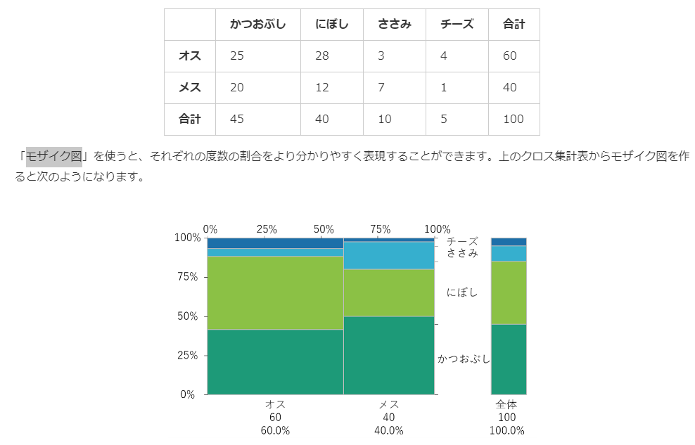
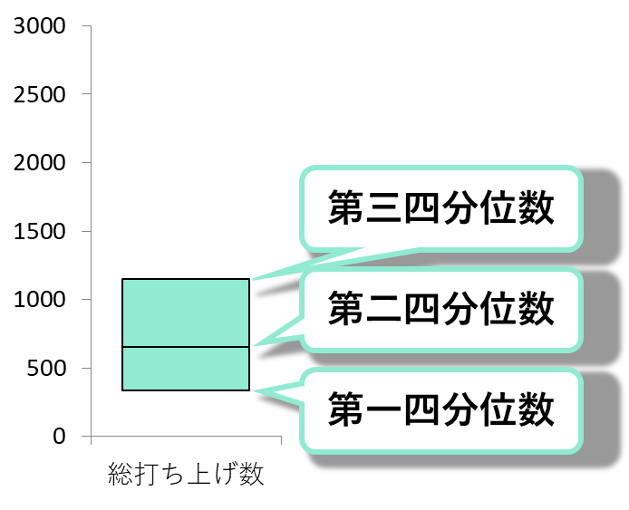
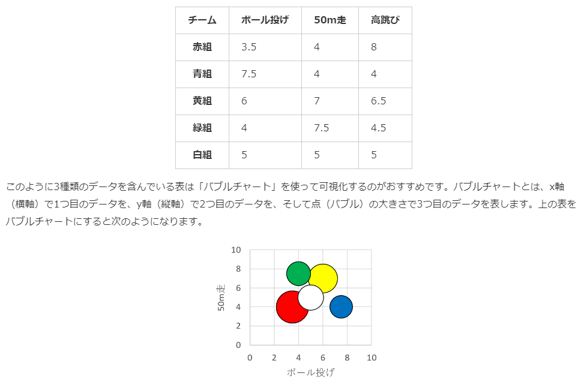
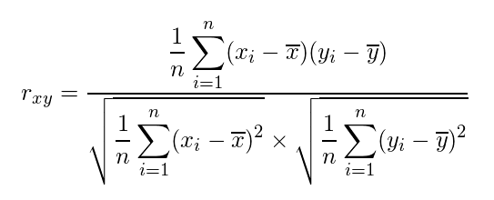

# 1. データの集計

## データのとり方の極意
- 1つのセル（表の中の1つ1つのはこのこと）には1つのデータを入れましょう。
- 足りないデータ（欠損値－けっそんち）や、おかしなデータ（外れ値－はずれち）がないか確認しましょう。
- 全角文字と半角文字とごちゃまぜにしないようにしましょう。
- データの単位は揃えましょう。
- 単位はセルの中ではなく、列名のセル（列の見出し部分）に書きましょう。

### 質的変数
性質を表すデータのこと
- 住所
- 血液型
- 好きな食べ物 etc...

* 質的変数を集計したとき(`集計表`)、それぞれのカテゴリの数を`度数`という

### 集計表の作り方の極意
- 度数には単位を書かず、値だけを記入しましょう。
- 度数の大小に従って集計表の中身を並べかえると見やすくなる場合があります。
- カテゴリ名に従って集計表の中身を並べかえると見やすくなる場合があります。
- データの単位は揃えましょう。
- 単位はセルの中ではなく、列名のセル（列の見出し部分）に書きましょう。

### 量的変数
数量を表す値のこと

- 離散変数
  - 兄弟姉妹の数のようにとびとびの値をとるもの
- 連続変数
  - 体長のようにすき間なく連続した値をとるもの

#### 度数分布表
* 量的変数の集計をする時に使う
  * ヒストグラムで表すことが多い
* 例

| 階級（cm以上～cm未満） | 階級値（cm） | 度数 | 相対度数 | 累積相対度数 |
| :-: | :-: | :-: | :-: | :-: |
| 26～28 | 27 | 5 | 5% | 5% |
| 28～30 | 29 | 10 | 10% | 15% |
| 30～32 | 31 | 30 | 30% | 45% |
| 32～34 | 33 | 35 | 35% | 80% |
| 34～36 | 35 | 20 | 20% | 100% |

- 「階級」は度数を集計するための区間を表します。
- 「階級値」はその階級を代表する値のことで、階級の真ん中の値のことです。
- 「度数」は各階級に含まれるデータ数を表します。
- 「相対度数」は各階級の度数が全体に占める割合のことです。
- 「累積相対度数」はその階級までの相対度数の全ての和（累積和）のことです。

#### 度数分布表の作り方の極意
- 階級の区切りは分かりやすい値を使いましょう。
- 階級の区切りは等間隔にしておきましょう。
- 階級の区切りの大きさや数には決まりがありませんので、データの分布をよく反映するものを選びましょう。

# 2. さまざまなグラフ

## クロス集計表
* 2つのカテゴリーに属するデータをそれぞれのカテゴリーで同時に分類し、その度数を集計したもの
  * 縦と横にカテゴリがあるやつ

## モザイク図
* クロス集計表の各層を縦棒の積み上げ棒グラフとして表したグラフのこと
  * 下記の例だと、性別のカテゴリーはオス：メス＝60：40なので、横幅の比は3：2になっています。
* 縦軸と横軸は逆でもいい

# 3. 時系列データ

## 時系列データの取り方の極意
* 時間の経過に従って測定されたデータのことを「`時系列データ`」といいます。
  * `折れ線グラフ`で表されることが多い

- 時系列データは時系列にそって並べておきましょう。
- ある時間のデータが重複しないように注意しましょう。
- 時間の間隔は一定でなくても問題ありませんが、データの特性が適切に把握できるような間隔にしておきましょう。

### 時系列データの変化の傾向の捉え方
- 差を使う
- 比を使う
- 変化率を使う
  - 前の時点に対するある時点の値の増減の度合い
  - （ある時点の値-前時点の値）÷（前時点の値）
- 指数を使う
  - ある基準時点での値に対する、それぞれの時点の値の比率
  - 基準値を100としがち
  - ｛（それぞれの時点の値）÷（基準時点の値）｝×100

# 4. 代表値と箱ひげ図
- 平均
- 中央値
- 最頻値
  - `モード`とも呼ばれる

## 四分位数
データを小さい順に並び替えたときに、データの数で4等分した時の区切り値のこと  
4等分すると3つの区切りの値が得られ、小さいほうから以下のように呼ぶ
- 25パーセンタイル（第一四分位数）
- 50パーセンタイル（中央値）
- 75パーセンタイル（第三四分位数）

* `四分位範囲`
  * 75パーセンタイル（第三四分位数）から25パーセンタイル（第一四分位数）を引いた値

### 四分位数の求め方
1. 中央値を求める
2. 中央値でデータを2つに分ける(データの数が奇数個の場合、中央値は除く)
3. 分けたデータの中央値を求める

### 箱ひげ図の書き方
1. 箱を書く
2. ひげを描く
   1. ひげの範囲は「箱の高さ（四分位範囲）の1.5倍以下の範囲のデータ」まで
3. 外れ値(ひげの範囲から外れたデータ)を描く

# 5. データのばらつき

* 図を見ると、ねこじゃらし公園に比べてまたたび公園の参加数は日によってかなりばらつきがあることが分かります。

## 分散・標準偏差
* ばらつきを表す値
  * ばらつきが大きい程、分散・標準偏差は大きくなる
* 分散の正の平方根が標準偏差
* 元のデータにある値を一律足した場合
  * 平均値: ある値を足したものになります。
  * 分散と標準偏差: 変化しません。
* 元のデータにある値を一律かけた場合
  * 平均値と標準偏差: ある値をかけたものになります。
  * 分散: ある値の2乗をかけたものになります。

## 変動係数
* 平均値に対するデータとばらつきの関係を相対的に評価するための値
  * 平均値が大きく異るデータのばらつきを比較する時などに使う？
* `変動係数＝標準偏差÷平均値`

# 6. データの標準化
## レーダーチャート
* いくつかの項目の大小を1つのグラフで表したグラフのこと
* 例

## 標準化
- データの変換方法の1つ
- 標準化したデータの平均は0に、分散（標準偏差も）は1になります。
  - これにより、異なる項目のデータであってもその大小を比較できるようになります。

**標準化の式: `{(元のデータ) - (平均値)} / (標準偏差)`**

## 偏差値
* 元のデータを平均が50、標準偏差が10となるように変換した値のこと
  * 具体的には、標準化した値を10倍して50を足すことで求められます。
* 偏差値が高いほど成績が良いことを、低いほど成績が悪いことを表します。
* 平均点と同じ点数だった場合、偏差値は50になります。
  * 平均点と同じ点数の場合には標準化した値が0となるため
* 平均値や標準偏差が異なる場合には、偏差値は異なったものになります。
* 偏差値は100以上の値やマイナスの値をとる場合があります。
  * 標準偏差が小さく、平均値からかけ離れた点数を取った場合には偏差値は非常に大きな値や小さな値をとります。

偏差値の式  

# 7. データの相関
## バブルチャート
- 3種類のデータを含んでいる表を可視化する手段の1つ
- x軸（横軸）で1つ目のデータを、y軸（縦軸）で2つ目のデータを、そして点（バブル）の大きさで3つ目のデータを表します。

## 相関係数
- 横軸が増加、縦軸も増加 → 正の相関がある
  - 正の相関が強いほど1に近づく
- 横軸が増加、縦軸は減少 → 負の相関がある
  - 負の相関が強いほど-1に近づく
- 相関が弱いほど0に近づく

相関係数の式

* 共分散 / {(xの標準偏差) × (yの標準偏差)}

## 相関係数を扱う際の注意点
* 外れ値がある場合、相関係数に影響を及ぼす可能性がある
  * まず散布図を作り、外れ値がないか等データの特徴を確認するようにしましょう。
* 元データを加工(単位の変更、一律でたす、かける)しても相関係数は変わらない
  * 一律で負の値をかけると相関係数の正負は逆転する
* 直線関係ではない相関がある場合がある
  * 相関係数は2つのデータによる直線的(`1次関数`)な相関関係の強さを表すもの
  * n次関数的な相関がある場合もある
  * いきなり相関係数を計算するのではなく、まずはデータをプロットした散布図を確認するようにしましょう。

# 8. 確率の計算
* いくつかの事象の起こりやすさがすべて等しいとき、「同様に確からしい」といいます。
* ある事象Aが起こる確率を`P(A)`で表す
* お互いの結果が影響しあうことがないとき、2つの事象は「独立である」と言います。
* Aという条件のもとでBが起こる確率`P(B|A)`で表す
  * P(B|A) = P(A ∩ B) / P(A)

# 9. 研究計画
## 研究(調査)の種類
- 観察研究
  - 研究対象に対して介入を行わなずに、研究対象の観察によってデータを集めて解析を行う研究のこと
    - 介入: 薬を飲んでもらったり、治療を受けてもらったりなど
    - アンケートを取るなど
- 実験研究
  - 研究対象に対して何らかの介入を行い、その効果を評価する研究のこと

## 研究の流れ(観察研究)
- 課題を設定する
  - どのようなことを調べたいのか
- 研究計画を立てる
  - 研究対象を誰（何）にするのか
  - 何をどのように測定するのか
  - どのような質問をするのか
- データを集める
  - 研究計画に従ってデータを集める
  - データの記入ミスや記入漏れのリスクを減らすため、事前にデータ記入シートを作成する
- データを分析する
  - 得られたデータを元に、結果を表やグラフにまとめます
  - 2つのグループの比較を行う場合には、それぞれのグループのデータの分布や平均値、中央値を比べる方法があります。
  - 2つのデータの関係を見たい場合には相関係数を算出する方法があります。
- 結果を考察する
  - 分析結果から、課題に対してどのような判断ができるかを考えます。
  - 「結果から考えられること」と「結果からは分からなかったこと」を明確に切り分ける
  - 「分からなかったこと」についてはその理由や問題点などについても考えます。

## 研究計画を立ててみよう
### 全数調査
調査対象となる集団を全て調べること。この集団のことを「母集団」といいます。

### 標本調査
調査対象となる母集団の一部を取り出して調べること。取り出された集団のことを「標本」といいます。

### 単純無作為抽出法
* 母集団の中からランダムに標本を抽出すること
* 標本調査の最も基本的な方法
* 母集団に含まれている個体に対して通し番号を振り、それらの番号の中からランダムに番号を選ぶことで単純無作為抽出を行うことができる

# 10. データの読み方
* 回答する選択肢がn段階になっているものを「n件法」といいます。
* 紙に印刷された質問に回答してもらう調査方法のことを「質問紙法」といいます。
  * アンケート調査でよく使われる方法です。
* ドットプロットは、それぞれの値を点でプロットしたグラフのことで、データの大まかな分布を知りたいときに使います。グラフ中の黒の横線は平均値を表しています。
  * 
* 「夕方5時に公園にいた猫の数」のように周期性があるデータの場合には、「自己相関」を算出することでその周期を確認することができます。
* 何かの値を予測するためには、回帰分析を行って「予測値」を求める方法があります。
* 比較したいグループ間である要素の分布が等しいかどうかを検定する手法として「独立性の検定」があります。
* クロス集計表の左側の項目「`表側（ひょうそく）`」といいます。
* 上側の項目を「`表頭（ひょうとう）`」といいます。