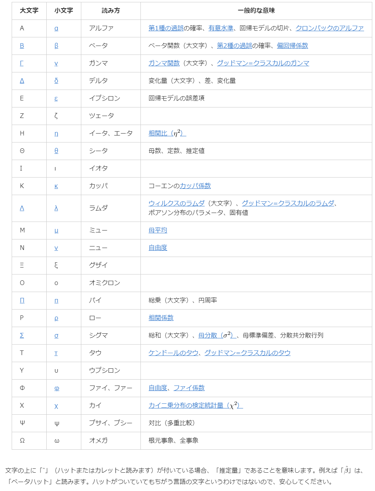

# 1. 統計ことはじめ
## ギリシャ文字

## 変数の尺度
- 統計学では、変数をその性質に応じて4つの尺度に分けて考えることがあります。
- 4つの尺度は、`名義＜順序＜間隔＜比例という上下関係`があり、上位の尺度は下位の尺度の統計量を用いることができます。
  - 現在では順序尺度に対しても順位相関係数を使うことがあります。
- 「間隔尺度」と「比例尺度」は非常に見分けづらい場合があります。
  - 2つの尺度を見分けるコツは、「0の値に相対的ではなく絶対的な意味があるかどうか」を考えること
    - 体重や速度など、「0」が「無い」ということを示す場合は比例尺度
    - 温度や西暦など、「0」が「無い」という意味ではない場合は間隔尺度
  - 比をとり、「1.5倍になった」等と言えるかどうかでも判断できる
- `名義尺度, 順序尺度 ∈ 質的変数(カテゴリー変数, カテゴリカル変数, categorical variable)`
- `間隔尺度, 比例尺度 ∈ 量的変数`

### 名義尺度
- 他と区別し分類するための名称のようなもの
- 例：
  - 男女
  - 血液型
  - 郵便番号
  - 住所
  - 本籍地
  - 所属学部
  - 学籍番号
- 使える統計量：
  - 各ケースの数
  - 計数（count）
  - 頻度（frequency）
  - 最頻値
  - 連関係数

### 順序尺度
- 順序や大小には意味があるが間隔には意味がないもの
  - 1位＋2位≠3位のように、足し算引き算ができないもの
- 例：
  - 1位 / 2位 / 3位…
  - 1. 好き / 2. ふつう / 3. 嫌い
  - 統計検定®1級 / 2級 / 3級 / 4級
  - がんのステージ分類におけるステージI / II / III / IV
- 使える統計量：
  - 中央値
  - パーセンタイル

### 間隔尺度
- 目盛が等間隔になっているもので、その間隔に意味があるもの
  - 気温が19℃から1℃上昇すると20℃になるとは言えるが、10℃から20℃に上昇したとき、2倍になったとは言えないもの
- 例：
  - 気温（摂氏）
  - 西暦
  - テストの点数
- 使える統計量：
  - 平均値
  - 標準偏差
  - 順位相関係数
  - 積率相関係数（いわゆる相関係数のこと）

### 比例尺度
- 0が原点であり、間隔と比率に意味があるもの
  - 身長が150cmから30cm伸びると180cmになると言えるし、1.2倍になったとも言えるもの
- 例：
  - 身長
  - 速度
  - 睡眠時間
  - 値段
  - 給料
  - 幅跳びの記録
- 使える統計量：
  - 変動係数

## 説明変数と目的変数
### 説明変数
何かの原因となっている変数  
y = ax + b における `x`
#### 同じ意味の言葉
- 説明変数
  - explanatory variable
- 予測変数
  - predictor variable
- 独立変数
  - independent variable

### 目的変数
原因(説明変数)を受けて発生した結果となっている変数
y = ax + b における `y`
#### 同じ意味の言葉
- 目的変数、応答変数、反応変数
  - response variable
- 結果変数
  - outcome variable
- 従属変数
  - dependent variable
- 基準変数
  - criterion variable
- 被説明変数
  - explained variable
