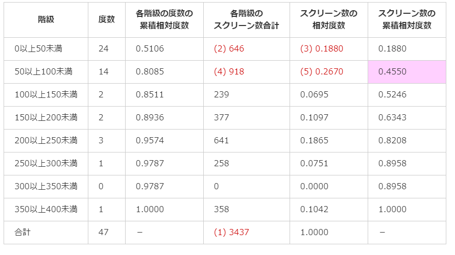

# 2. 度数分布とヒストグラム
## ヒストグラム
* 横軸は`階級`、縦軸は`度数`を表す
* 棒グラフは質的データの可視化に使うのに対し、ヒストグラムは量的データの可視化に使う

## パレート図
* ヒストグラムの各階級の棒を度数が大きい順に左から並べ替え、その上に累積相対度数の折れ線グラフを重ねるたもの
* ヒストグラムに加え、右側の縦軸で累積相対度数を表している

* 上記のように右に行くにつれて度数が減るヒストグラムを下記のように呼ぶ
  * 右裾が長い
  * 右に歪んだ
  * 左に偏った

## 階級幅の決め方
特に決め方はないが、大きすぎても小さすぎてもよくない  
迷ったら`スタージェスの公式`を使用するのもいい(大体の参考値)
```python
# スタージェスの公式(nはデータ数)
階級の数 = 1 + log(2)n
```

## ローレンツ曲線
* `偏り＝不均等さ`を表すための曲線
* 以下2つの累積相対度数を元に作られる
  * 各階級の度数の累積相対度数
  * 各階級に属する値の合計の累積相対度数
    * 分布ではなく、実際の値
    * 階級内の合計数 / 全ての合計数 の和

* 上記の度数分布表を元に、「各階級の度数の累積相対度数」を横軸に、「スクリーン数の累積相対度数」を縦軸にとった折れ線グラフが都道府県ごとのスクリーン数のローレンツ曲線です。

* 大体の場合下に凸だが、上凸の場合もあり

## ジニ係数
* 「偏り」や「不均等さ」を数値で表したもの
* 完全平等線とローレンツ曲線の間の面積の2倍で計算される
* 0 < ジニ係数 < 1(大きいほど偏りが大きい)
  * 全く不均等でない場合、0


