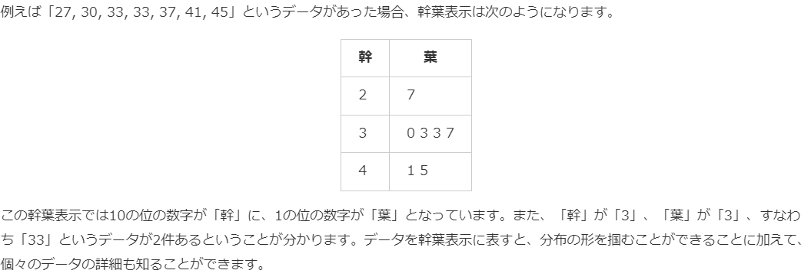

# 4. 箱ひげ図と幹葉表示
* 四分位範囲（Inter Quarter Range 略してIQR）
* 各区間に入ってるデータ量は同じ
  * つまり、図の幅でデータのばらつき具合が知れる(広いほどバラバラ)
* ひげの上限がある(外れ値がある)タイプの箱ひげ図とそうじゃないものがある
## パーセンタイル
データを小さい順で並べたとき、ある数値がデータの小さい方から見て何％の位置にあるかを表すもの

## 5数要約（five-number summary）
* 以下の5つの値のこと
  * 最小値
  * 第一四分位数
  * 中央値
  * 第三四分位数
  * 最大値
* 最大値から最小値を引いたものを「範囲」といいます。

## 幹葉表示（stem-and-leaf display）
* データの値そのものを用いて作成するヒストグラムに似た図のこと
  * `幹葉図（stem-and-leaf plot）`とも呼ばれます。
* 幹と葉から構成される
  * 個々のデータは、縦向きに並ぶ「幹」に対応した1桁の数字が「葉」のように幹の横に並びます。
  * 「幹」の数字は上から下に向かって小さい順に並び、同様に「葉」の数字も左から右に向かって小さい順に並びます。
* 幹葉表示は先頭2桁に注目して作ることが多いため、小数点は切り捨てて作成する場合もある。

