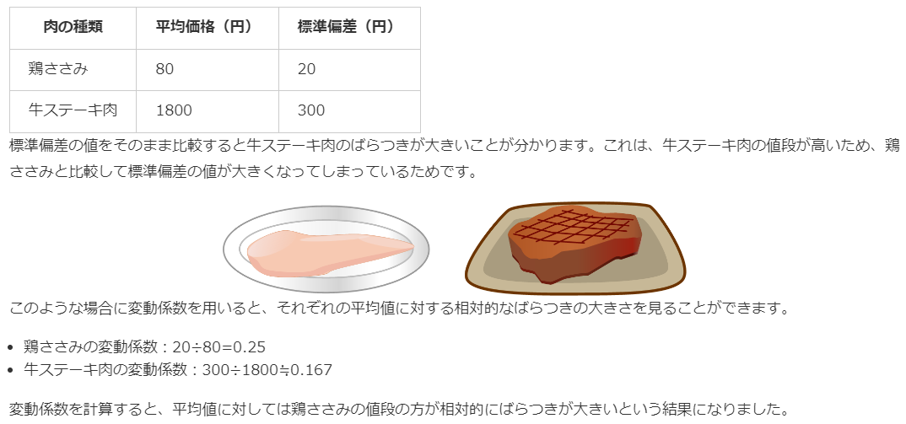

# 6. 分散と標準偏差
## 偏差
* 平均値と各データの差
* 偏差の和は常に0になる

## 平均偏差
絶対値を付けた偏差の平均

## 分散
絶対値の計算は絶対値記号を外すために場合分けをする必要があり、数学的に面倒であるという平均偏差のデメリットを解消したもの。

## 標準偏差(standard deviation, SD)
分散は2乗しているため単位が変わってしまう(cm→cm^2)ので、  
平方根を取った`標準偏差`を求めることで平均との計算などに使うことができる  
`σ`で表されることが多い

## 変動係数
* 標準偏差を平均値で割った値のこと
* 単位の異なるデータのばらつきや、平均値に対するデータとばらつきの関係を相対的に評価する際に用いる単位を持たない（＝無次元の）数値
* `CV`で表されることがある

* 変動係数は、平均値に対して標準偏差が比例関係にあるものに対して適用するのが正しい使い方です。
  * 比例尺度の場合に有効な指標であり、間隔尺度では参考になりません。
