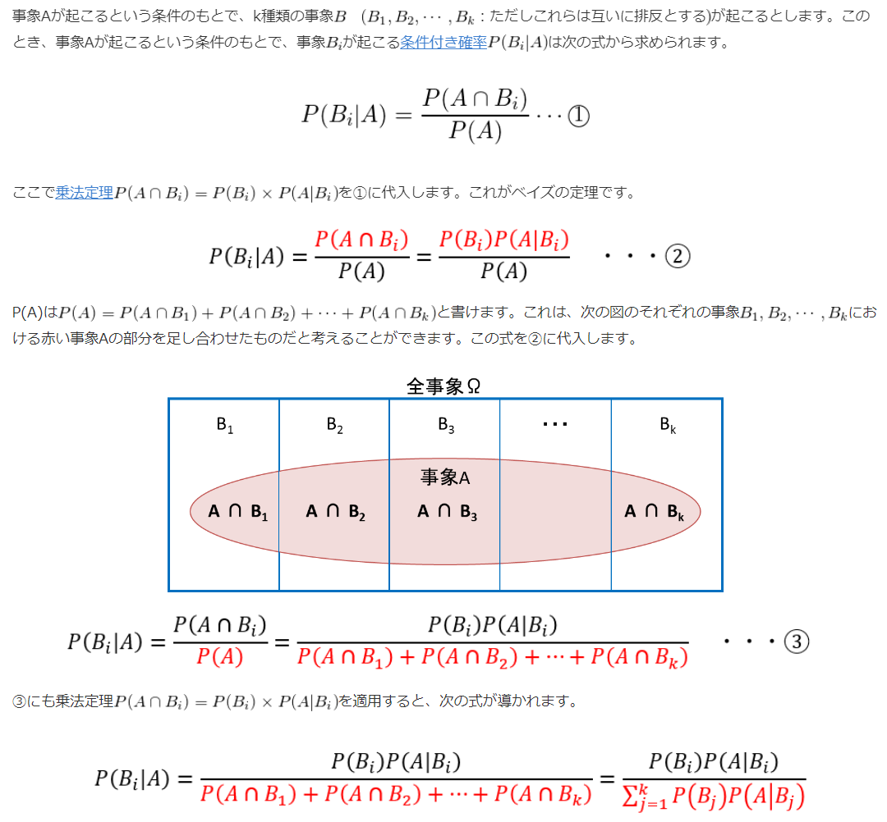

# 10. 条件付き確率とベイズの定理

* P(A|B): 条件付き確率
* P(A|B) = P(A) のとき、事象A, Bは独立である
* `【事象Bが起きるという条件のもと事象Aが起きる確率】`は、全体が`【事象Bが起きる確率】`であるうちの`【事象A,Bがどちらも起きる確率】`に等しい

## 乗法定理

* 条件付き確率の公式より、両辺にP(B)をかけると上記の式になる

## ベイズの定理

* 条件付き確率の計算式に乗法定理を代入しただけ
* 求める値が事象A,Bで逆転するので、結果から原因を推定するのに使用できる

## 事前確率
事前 = 事象Aが起こる前

## 事後確率
事前 = 事象Aが起きた後の確率

## 医学における検査用語
- 感度（真陽性率）
  - 実際にその病気に罹患している人の中で、検査で陽性になった人の割合
- 特異度（真陰性率）
  - その病気に罹患していない人の中で、検査で陰性になった人の割合
- 偽陽性率
  - その病気に罹患していない人の中で、検査で陽性になった人の割合
- 偽陰性率
  - 実際にその病気に罹患している人の中で、検査で陰性になった人の割合
