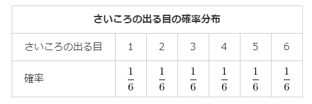
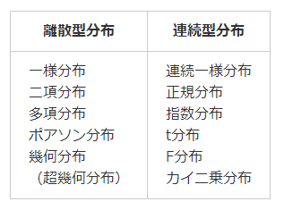

# 11. 確率変数と確率分布
## 確率変数
- ある変数の値をとる確率が存在する変数のこと
  - さいころでいうと、1,2,3,4,5,6

  

* さいころを投げて3の目が出る事象の確率は1/6である の表記

## 確率分布
- 確率変数がとる値とその値をとる確率の対応の様子

* さいころの例

## 離散型確率変数
`離散型変数`: とびとびの値をとる変数のことで、隣り合う数字の間には値が存在しないものを指す  
例) さいころ(さいころの3の目の次は4であり、その間に3.2や3.5といった数値は存在しません。)  

離散型変数Xの取りうる値それぞれに対応する確率pが存在する場合、この変数を`離散型確率変数`といいます。

## 離散型確率分布
離散型確率変数の確率分布  

## 離散型確率分布

* 横軸: 確率変数X
* 縦軸: 確率P(X)

## 確率質量関数
離散型確率変数Xがある値xをとる確率を関数f(x)とした場合、`f(x)`は`確率質量関数`である
```
// X = x(ある値)となる確率
f(x) = P(X = x)

Σ P(X = xi) = 1
```

## 連続型変数
重さや温度などのように連続した値をとるもの  

連続型確率変数がとる値が1から6までの実数の場合、  
`P(X=3) = 1/∞ = 0`(点は無限に存在するため)

## 確率密度
定義域内でのXの値の「相対的な出やすさ」を表すもの  

* `連続型確率分布`のイメージ図
* 縦軸f(x)は確率密度

## 確率密度関数
* 連続型確率変数Xがある値xをとる確率密度を関数f(x)で表したもの
* f(x) ≧ 1 になる場合もあり
* f(x) = f(X = x)
  * X = x(ある値)となる確率

## 連続型確率分布と確率
確率密度関数の場合、確率変数がある一点の値をとる確率は0になることから、”ある範囲”をとることで確率を求められます。  
  
* a ≦ X ≦ b(確率変数Xが取る値がa以上b以下)
* 普通に積分する


* 全事象が起こる確率は1であることから


