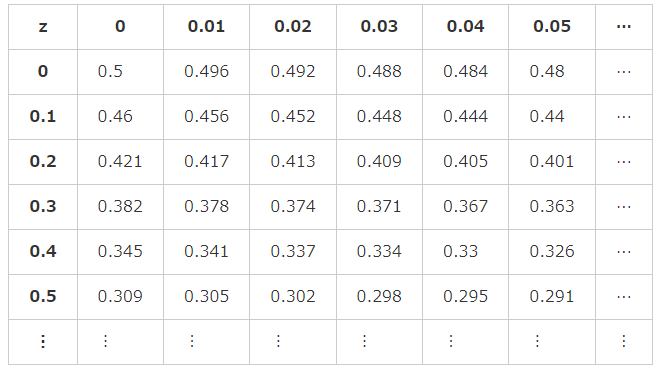

# 14. いろいろな確率分布2
## `正規分布`
* 統計学における検定や推定、モデルの作成など様々な場面で活用される連続型確率分布
* 多くの統計的手法において、データが正規分布に従うことを仮定する
* 
  * 横軸: 確率変数
  * 縦軸: 確率密度

* 正規分布の確率密度関数
  * `exp(n)` はe^n と同じ
  * σ、μ がパラメータ
* 期待値E(X) = μ
* 分散V(X) = σ^2
```
X ~ N(μ, σ^2)
```

* 正規分布は平均(期待値)と分散に従う
  * 平均値が最も高く、左右に離れるにつれて低くなるグラフになる
  * σが大きいほど分布の山はなだらかになる

正規分布は平均を中心に左右対称で、教会にある「ベル（釣鐘）」のような形をしていることから、「ベルカーブ（bell curve）」ともよばれます。

### 正規分布の再生性
独立した2つの正規分布に従うデータを足したデータは、正規分布N(μ1+μ2, σ^2(1)+σ^2(2))に従うという法則のこと

### `標準正規分布`
正規分布の中で、特に平均: μ=0, 分散: σ^2=1 であるもののこと
```
X ~ N(0, 1)
```

* 正規分布の公式より自明


* 標準正規分布のグラフ

### `標準化`

* zは標準正規分布に従う
* zを`z値`。`標準化得点`と呼ぶ
* z値が大きいほど相対的な値が大きいことになる
* 平均が50点、標準偏差が10点となるように、50+10×z としたものを`偏差値`と呼ぶ

### `標準正規分布表`

* 標準正規分布の累積分布関数F(X)を計算するのは面倒なので、用意されている表
* `統計数値表`の一種
* z値を小数点第1位以上とそれ以下で分け、左端の列で小数点第1位以上、上端の行で小数点第2位以下を見る
* 負の値は無いが、Z=0に対して左右対称なので絶対値で考えてOK
* 平均から1標準偏差の範囲でおよそ70％を締めているという性質がある
