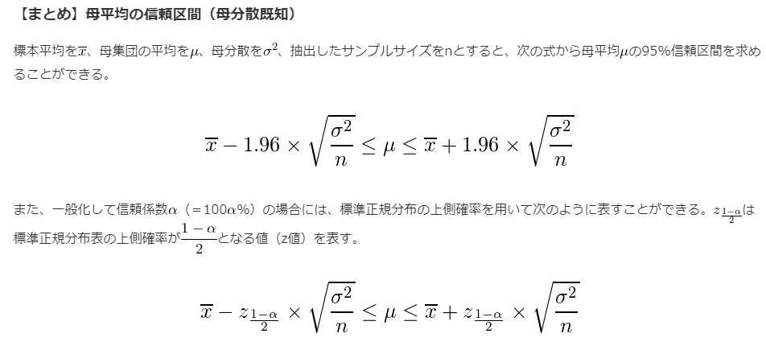

# 19. 母平均の区間推定（母分散既知）
## 区間推定
* 母集団の従う分布が正規分布であると仮定できるときに、標本から得られた値を使ってある区間でもって母平均などの母数を推定する方法
  * このときの区間のことを`信頼区間`という
    * 略語表記として`CI`と表記されることもあり
* 母平均の区間推定では、`母分散`が分かっている場合と分からない場合とで、その算出方法が異なる
  * わかっている場合、母分散`σ^2`の値を使い、`標準正規分布`を用いて信頼区間を算出する
  * 母平均が分からないのに母分散だけは分かっている、という状況は現実にはほとんどない
  * 母平均の区間推定を行う場合には大抵`t分布`を用いた方法を使う
* 母平均の区間推定では`95%信頼区間（95％CI）`を求めることが多い
  * 母集団から標本を取ってきて、その標本平均から母平均の95%信頼区間を求める、という作業を100回やったときに、95回はその区間の中に母平均が含まれる
* `99%信頼区間`や`90%信頼区間`のような、ある区間に母数が含まれる確率のことを`信頼係数`あるいは`信頼度`という

## 例: 母平均の95%信頼区間の求め方
* 母平均の信頼区間の算出には中心極限定理を利用する
* 標本平均を標準化する理由は、標準正規分布を利用するため

1. 標本平均`x(bar)`を求める
2. 標本平均の標準化を行う
3. 2の値が標準正規分布の95%の面積(=確率)の範囲にあるかを調べる(標準正規分布表から上側2.5%点を調べる)

* 参考: 母平均の95%信頼区間で、標準化した標本平均が取るべき値
  * `1.96`という値は覚える価値あり

4. 3の式を母平均`μ`について解く

* 信頼係数が大きいほど、信頼区間の幅は広くなる
* サンプルサイズｎが大きいほど、信頼区間の幅は狭くなる

* 上側確率(下側確率)
  * ある値▲より大きくなる確率が☆%であるとき、この▲のことを「上側☆%点（パーセント点）」といいます

