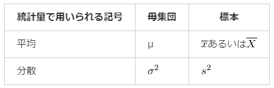
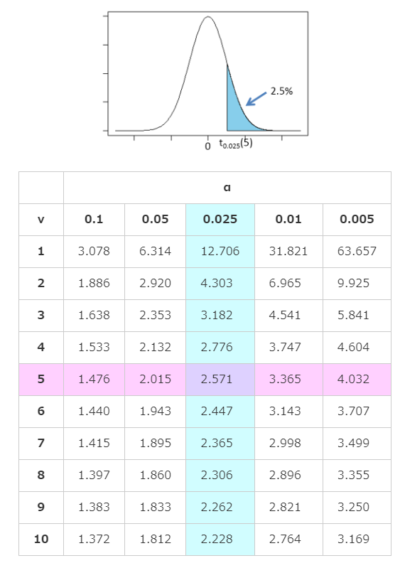

# 20. 母平均の区間推定（母分散未知）

* おさらい
## 標本とt分布
* 母平均の区間推定を行う場合に、母分散が分からない時は代わりに`不偏分散`を使う
* 不偏分散を使って母平均の区間推定を行う場合は、標準正規分布ではなく`t分布`を使う

### `t分布`(Studentのt分布)
* 標準正規分布とよく似た形の分布
* パラメータである`自由度`によって分布の形が変わるという特徴を持つ
  * 自由度: ある変数において自由な値をとることのできるデータの数
  * 例えば、n個のデータがあるとき、これらはどれも自由な値を取りうるので自由度はnである
  * 一般に、n個のデータの間でk個の条件があるとき、自由度はn-kとなる。
    * 平均値x=a という条件の時、自由度はn-1

* df: 自由度
* nomal: 標準正規分布
* 自由度が大きくなるにつれて、標準正規分布に近づく

* 統計量tの算出式

### t分布の性質
  

* 確率変数Xが自由度mのt分布に従っている場合

## t分布表

* v: 自由度
* a: グラフにおける面積(確率？)

## 母平均の信頼区間の求め方（母分散未知）

上記より、母平均μの100(1-α)%信頼区間が求まる
* μ: 母集団の平均
* x(bar): 標本平均
* s^2: 不偏分散
* n: 抽出したサンプルサイズ
* (1-α): 信頼係数(= 100(1-α)%)
* t(a/2)(n-1): 自由度が`(n-1)`のt分布における上側確率が`a/2`となる値(t値)

* 信頼係数が大きいほど、信頼区間の幅は広くなる
* サンプルサイズｎが大きいほど、信頼区間の幅は狭くなる

## 母平均の差の信頼区間
* 母平均の差 = 2つの異なる母集団の平均の差
* 母平均の差の信頼区間も算出できるが、2つのデータが「対応のあるデータ」か「対応のないデータ」かによって算出方法が異なる
  * 対応があるデータ: 同じ対象に対する2つのデータのことで、データがペアになっているものを指す
    * サンプルサイズは必ず等しくなる

### 対応があるデータの場合
普通に差の平均値と不偏分散出して計算する

### 対応がないデータの場合
1. それぞれのデータの平均値と不偏分散を求めます
2. それぞれのデータから算出される分散をまとめた分散(`プールされた分散`)を、次の式から算出します

3. 次の式から母平均の差の95%信頼区間を求めます

   * t(a/2)(n1+n2-2): 自由度が(n1+n2-2)、信頼係数が(1-α)100%の時のt分布表の値