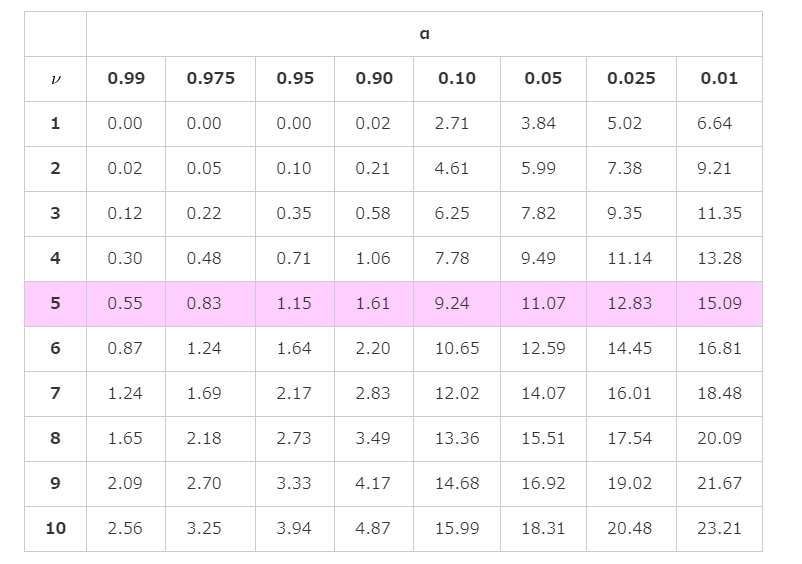

# 22. 母分散の区間推定
## カイ二乗分布
  
* `Z1, Z2, …, Zk`が互いに独立で標準正規分布`N(0,1)`に従う確率変数であるときに、上記の式から算出される自由度kの`χ^2`が従う確率分布のこと
* 母分散の区間推定や適合度の検定、独立性の検定などに使われる
* 自由度によってグラフの形が異なる分布
  * 自由度が大きくなるにつれて正規分布に近づく

  
* 自由度が1のとき、カイ二乗分布は標準正規分布に従う確率変数を二乗したものに等しくなる

* カイ二乗分布の確率密度関数(自由度k)
* `Γ(): ガンマ関数`
* 覚える必要なし

* k: 自由度

### カイ二乗分布の性質
#### 期待値と分散
* E(X) = k
* V(X) = 2k

#### 再生性
2つの確率変数`X1`,`X2`がそれぞれ独立に自由度`k1`,`k2`のカイ二乗分布`χ^2(k1),χ^2(k2)`に従うとき、`X1+X2`は自由度`k1+k2`のカイ二乗分布`χ^2(k1+k2)`に従う

#### 正規分布に従う母集団からの無作為標本
  

#### カイ二乗分布と指数分布の関係

* 自由度2のカイ二乗分布はλ=1/2の指数分布と一致する。

## カイ二乗分布表
  

* v: 自由度
* a: 面積

## 母分散の区間推定
* カイ二乗分布を使う

* 上記`χ^2`が自由度`n-1`のカイ二乗分布に従うことを用いて母分散の信頼区間を計算する
* n: サンプルサイズ
* s^2: 不偏分散
* 条件: 母集団が母分散σ^2の正規分布に従う時

* カイ二乗分布は左右対称ではないため、上側2.5%点と下側2.5%点をそれぞれ読み取る必要があることに注意