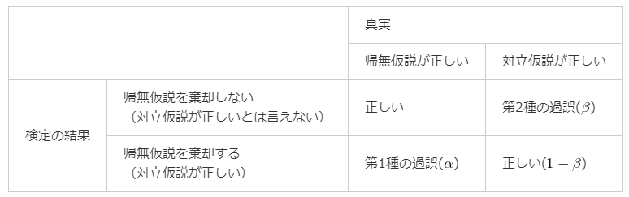
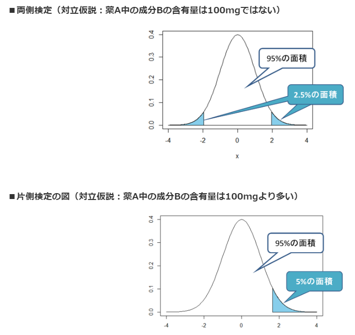

# 23. 検定の前に
## 検定とは
* 確率をもとに結論を導く方法
* 最初に仮説を立て、実際に起こった結果を確率的に検証し、結論を導く
* 結論を導くには`背理法（はいりほう）`を用いる
  * `背理法`: 最初に仮説を設定し、仮説が正しいとした条件で考えて矛盾が起こった場合に仮説が間違っていると判断する
  * “滅多に起こらない”と判断する確率の基準を設定し、そのラインを超えたか否かで判断する
    * 基準は先に決めておく必要がある
    * 導かれた結論は「絶対に正しい」と考えることはできない

## 検定で使う用語
* `帰無仮説`
  * 検定を行うため立てる仮説のこと
  * この仮説を元に検定を行い結論を導く
  * `H0`と書かれることがある
    * H: hypothesis(仮説)
* `対立仮説`
  * 帰無仮説に対する仮説のこと
  * 本来証明したい仮説
  * `H1`と書かれることがある
* `検定統計量`
  * 帰無仮説が正しいと仮定したときに、観測した事象よりも稀なことが起こる確率を計算するための値
  * `統計量`と呼ばれることもある
* `P値`
  * 帰無仮説が正しいとした仮定とき、観測した事象よりも極端なことが起こる確率
  * 累積確率である
  * `有意水準`と比較するためのもの
* `有意水準`
  * 帰無仮説を`棄却`するための基準となる確率
    * これを下回った場合、「極めて珍しいことが起こった」あるいは「何かしら意味があることである（＝”有意である”）」ということを表す
  * 検定を行う前に決めておく必要がある
  * `危険率`と呼ばれることもある
  * `α`で表され、5%や1％といった値がよく使われる
  * `第1種の過誤`: 本当にたまたま珍しい事象が起きただけなのに、帰無仮説を棄却してしまう確率のこと
    * 有意水準は「第1種の過誤を犯す確率」であるとも言える
* `棄却`
  * 仮説を捨てること
  * P値が有意水準よりも小さい時は、帰無仮説を捨て対立仮説を採択する(対立仮説が正しいと結論付けられる)
* `検出力`
  * 有意水準と対するもの
  * `1-β`で表される
  * 帰無仮説`H0`が正しくないときに、正しく`H0`を棄却する確率
  * `β`: 第2種の過誤の確率
    * 対立仮説が正しいのに帰無仮説を棄却しない確率

* 第1種の過誤の確率と第2種の過誤の確率はトレードオフの関係になっているため、同時に低くすることはできない

## 検定統計量
身長や体重など、取りうる値がどのくらいの確率でその値となるかが分からないデータを「検定するための値」に変換したもの
### 代表例
* 統計量z(z値)
  * 平均が0、分散が1となるようにデータを標準化した値のこと
  * 標準正規分布に従うため、統計量zを用いた検定を行う際には標準正規分布を使う。
* 統計量t(t値)
  * サンプルサイズがnの場合、統計量tは自由度n-1のt分布に従う
  * 統計量tを用いた検定(t検定)は、調べる値の母集団が正規分布することが前提条件となります

分布図のグラフにおいて、帰無仮説が棄却される領域のことを`棄却域`、されない領域を`採択域`と呼ぶ

## 両側検定と片側検定
両側検定にするか片側検定にするかは、実験の目的に合わせて検定を行う前に決めておかなくてはならない。

* 両側検定
  * 帰無仮説に対して「!=」で判断する
* 片側検定
  * 帰無仮説に対して「>, <」で判断する

* 有意水準5%の例