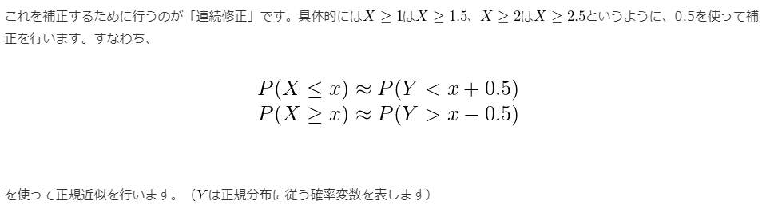
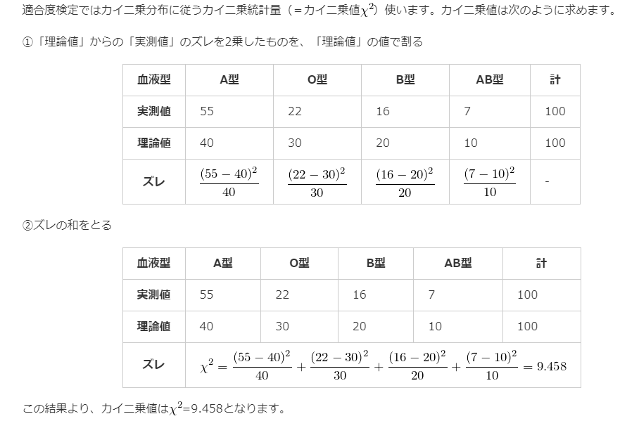

# 25. さまざまな検定
## 二項分布を用いた検定
### 連続修正
* 二項分布は離散型確率分布であるため、連続型確率分布である正規分布に近似しようとすると、誤差が出てしまう
* 上記を補正するために行われるのが`連続修正`

## 適合度の検定
* 調査によって得られたクロス集計表がある場合、実測度数がある特定の分布に適合（一致）するかどうかを検定することを`適合度の検定`という
* カイ二乗分布を用いる
* `理論値`(対象の分布に完全に一致した値)から実測値のズレを算出して計算を行う
* 上側P値（右側P値）を参照する

* カイ二乗値`χ^2`の求め方

## 独立性の検定
* 2つ以上の分類基準を持つクロス集計表において、分類基準間に関連があるかどうかを検定すること
  * 関連性→合計値に従う
* カイ二乗分布を用いる
  * m×nのクロス集計表の場合、自由度`(m-1)(n-1)`がのカイ二乗分布を用いて検定を行う
* 上側P値（右側P値）を参照する
* 帰無仮説を「独立である(関連がない)」とする
  * カイ二乗分布は独立であるデータ同士に使用するもののため？

### イェーツの補正
* 2×2のクロス集計表のデータに対して行われる補正
* 離散型変数である検定統計量を連続型分布（カイ二乗分布や正規分布）に近似させて統計的検定を行う際に生じる誤差（ズレ）を補正するために用いる

* Oij: 実測値
* Eij: 理論値

## 母比率の差の検定
  
