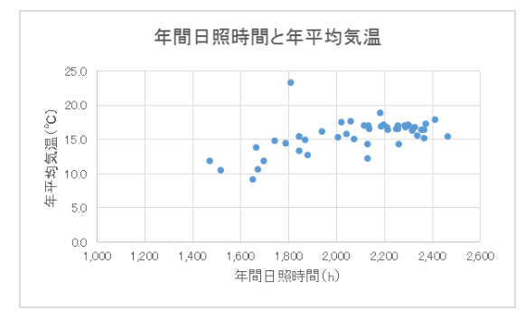

# 26. 相関分析
## 散布図
* 2つの要素からなる1組のデータが得られたときに、2つの要素の関係を見るためにプロットしたグラフのこと
* 1つ目の要素を横軸に、2つ目の要素を縦軸に取る
  * 1つ目の要素が変化したときに、2つ目の要素はどのように変化するかを確認することができる

## 相関関係と因果関係
相関関係はどちらが原因かはっきりしていないが、因果関係は原因側がわかってる

## 相関係数

* 共分散 ÷ (xの標準偏差 × yの標準偏差)
* -1から1までのいずれかの値をとる
* 1に近いほど相関が強く、0に近いほど相関が弱い
* 0に近くても、何らかの関係がある場合がある
* 単位を持たない
  * データの単位がどのようなものであっても計算できる

## 無相関の検定
* 標本から算出した相関係数を使って、母集団の相関係数が0かどうかを検定すること
  * 帰無仮説は「母相関係数は0（無相関）である」
  * t分布を用いて行う
  * 自由度n-2のt分布に従う
* 標本では相関がある場合に、母集団でも同様に相関があるかどうかを確認できる

* r: 標本から算出した相関係数
* n: サンプルサイズ

## 母相関係数の信頼区間

* 標本の相関係数を上記の式でz値に変換する
  * `フィッシャーのz変換`と呼ぶ

* 同様に、母相関係数ρがz変換された値を`ζ(ツェータ)`で表す

* zはサンプルサイズnが大きい時には、平均ζ、分散1/n-3 の正規分布に従う
* 上記はzを標準化する式

  

* 上記の標準化したz値が標準正規分布N(0,1)に従うことから算出した`100(1-α)%`信頼区間

  
  

* `ζ`を母相関係数ρに戻した式

## 偏相関係数

* 上記における映画館のスクリーン数と薬局の数のような、`第3の因子`により擬似的に高くなっている相関関係のことを`見かけ上の相関`や`疑似相関`という
* `見かけ上の相関`がある場合は、相関係数ではなく第3の因子の影響を除いた相関係数である`偏相関係数`を用いて相関関係を評価する

* 偏相関係数の算出式
* 1つ目の因子をx
* 2つ目の因子をy
* 3つ目の因子をz
* xとyの相関係数: r(xy)

## 層別解析
データの中にいくつかの異なる性質の集団が含まれている場合、データを分割して解析する方法のこと  
例: 各都道府県の年間日照時間と年平均気温の関係を調べる時に、雪の多い都道府県と少ない都道府県で2つに分ける