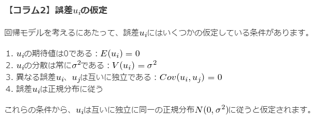
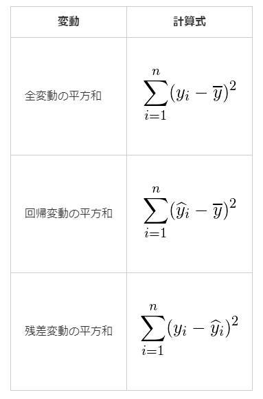
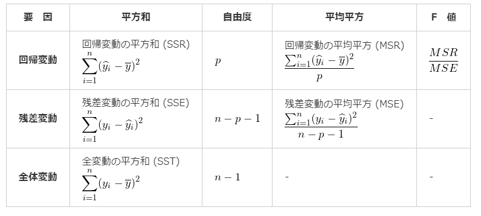

# 27. 回帰分析
* `回帰`: 目的変数について説明変数を使った式で表すこと
  * この式のことを`回帰方程式(回帰式)`という
  * `回帰式`を求めることを`回帰分析という`

## 単回帰分析
* 単回帰: 説明変数(x)が1つだけ使われている回帰式のこと

## 最小二乗法
すべてのデータ(点)における`真の回帰式`と実際のデータの値の誤差(`u`)の和の2乗が最小になるようにする方法  

* `ei: 残差`
  * データを回帰式に代入して得られた値と、実際のデータとの差
* 最小二乗法により推定された`β0`と`β1`は`偏回帰係数`と呼ばれる
  * 実際のデータから算出された推定値であり、真の回帰式における`β0`と`β1`とは異なることから`「^（ハット）」`をつける
* 上記の式を`β0`と`β1`で偏微分した式を0とすることで偏回帰係数を求める

### 偏回帰係数の算出
  

* 最小二乗法の式を`β0`と`β1`で偏微分した式 = 0 とした式
* 正規方程式と呼ばれる

  
  

* 最終的な`β0`と`β1`の算出式
* Sxy: xとyの共分散
* S^2(x): xの分散
* rxy: xとyの相関係数

## 回帰の現象（平均への回帰）
* データを繰り返し測定すると、1回目の測定で高かったり低かったりした値は、2回目の測定ではより全体の平均に近づいた値として観測される可能性が高いという現象のこと

## 回帰の錯誤（回帰の誤謬）
* 回帰の現象が観察された場合に、対象者に行われた処置や対応による効果であると誤って判断してしまうこと
  * 例: 1回目の血圧測定で高めの値が出た人に対して「ゆっくりと深呼吸するように」と指摘したことによって、2回目の測定では血圧が下がったと誤った判断を行ってしまう場合

## 回帰式の特徴
* 推定値の平均値は、実際の観測値の平均と等しい
* 回帰直線は(x(bar), y(bar))を通る

## 重回帰分析
* 説明変数を複数使用した回帰式のこと
* 偏回帰係数は最小二乗法で求める

* 4変数の例

### `標準偏回帰係数`
* 説明変数および目的変数をそれぞれ標準化した値から算出される偏回帰係数のこと
* 重回帰式における各変数の重要性を表す指標
  * 標準化偏回帰係数どうしの大小を比較できる

### 偏回帰係数の有意性の検定
* 定数項も含めた各偏回帰係数`βi^`が0であるかについての検定結果
* 帰無仮説は「偏回帰係数=0」
* 偏回帰係数`βi^`を標準誤差で割った値について、自由度`n-k-1`のt分布を用いて検定を行う

* 上記で算出した統計量tが自由度`n-k-1`のt分布に従う

### 偏回帰係数の信頼区間

* `偏回帰係数の有意性の検定`で用いた自由度`n-k-1`のt分布を使って、偏回帰係数`βi^`の`100(1-α)%`信頼区間を求められる

### ダミー変数
男性=0, 女性=1 などのように、もともと数値でないデータに対して、0と1を用いて数量化した変数のこと

## 予測値と残差
* `予測値`
  * 回帰式において、ある値xから予測されるの`y^`値のこと
  * 予測値`y^`と実際のデータyとの差は`残差(回帰残差)`と呼ばれる

* ei: 残差

* 誤差: 真の回帰式(理論的なもの)と実際のデータの差
  * 理論的なものなので、計算で求められない
* 残差: 推定された回帰式と実際のデータの差
  * 残差の総和は0である
  * 説明変数`xi`と残差`ei`の積和は0である
    * `Σxi・ei = 0`
    * 説明変数と残差との間には相関がないということを表す

## 残差分析
* 回帰式を評価する方法の1つ
* 残差のばらつきを見る
  * 回帰式がデータに対して妥当であれば、残差は適当にばらつく(`分散均一性`)

### 残差プロット

* 各データの残差を左から順番に並べたグラフ
  * 横軸: データの番号
  * 縦軸: 残差の値
* 縦軸の「0」に対して、残差がどのようにばらついているかを確認する
  * 残差が縦軸「0」に対して均一に分散している場合、大きな問題なし
  * 大きく外れている値が少数ある場合、`外れ値`である可能性がある
  * 残差が徐々に大きくあるいは小さくなっていたり、何かしらの傾向が見られる場合は、推定された回帰式が間違っている可能性がある

## 決定係数
* データに対する、推定された回帰式の当てはまりの良さ（度合い）を表す
* `R^2`で表される
* 0から1までの値をとる
  * 1に近いほど回帰式が実際のデータに当てはまっている(説明変数が目的変数をよく説明している)ことを表す
* **異なる回帰モデル間での良し悪しを判断することができる**

### 決定係数の求め方
実際のデータと推定された回帰式から以下の3つを求める必要がある

* 全変動
  * 実際のデータとデータ全体の平均値との差
* 回帰変動
  * 推定された回帰式から得られた予測値とデータ全体の平均値の差
* 残差変動
  * 実際のデータと推定された回帰式から得られた予測値との差

* 上記の変動は二重和として求める
* `全変動 = 回帰変動 + 残差変動`

* 
* 決定係数は、説明変数が目的変数をどれくらい説明しているか(**回帰変動が全変動に対してどれだけ多いか=残差変動が全変動に対してどれだけ少ないか**)を表すもの
* よって上記のように、回帰変動を全変動で割ることで求められる

### 自由度調整済み決定係数
* 決定係数は説明変数の数が増えるほど1に近づくという性質を持つ
  * 上記を補正するために、説明変数の数が多い場合は`自由度調整済み決定係数（自由度修正済み決定係数）`を使用する
* 特に、説明変数の数が異なる回帰モデルどうしを比較する場合に使われる

* 自由度調整済み決定係数の算出式
* n: サンプルサイズ
* k: 説明変数の数
* 決定係数 > 自由度調整済み決定係数

## 重相関係数
* 実際に観測された目的変数の値と、重回帰式をあてはめて計算した推定値（理論値）との相関係数
* `R`で表される
* 0から1までの値をとる(1が良い)

## 回帰の有意性の検定
* 複数の説明変数における回帰係数の効果を同時に検定する（`回帰式そのものが目的変数に対して効果があるかを検定する`）場合にはF分布を用いて回帰の有意性の検定を行う
* ある説明変数の偏回帰係数が0である（`目的変数に対して効果がある`）かを検定する場合には、t分布を用いて偏回帰係数の有意性の検定を行う
* 各種`変動`を活用する

  

* `MSR`: 回帰変動の平均平方(mean squared regression)
* `MSE`: 残差変動の平均平方(mean squared error)
* `SSR`: 回帰変動の平方和(Sum of Squared Regression)
* `SSE`: 残差変動の平方和(Sum of Squared Error)
* n: データの数
* k: 自由度
* yi: 実際のデータ
* yi^: 推定値
* y(bar): データ全体から求められる平均値

* `回帰変動の平均平方`と`残差変動の平均平方`の比が自由度(`n, n-k-1`)のF分布に従う
* `MSE`に対する`MSR`が相対的に大きいかどうかを検定する
  * 大きい場合: 回帰変動による効果は有意である（`回帰式そのものが目的変数に対して効果がある`=偏回帰係数のいずれかが0ではない）
  * 小さい場合: 回帰変動による効果は有意であるとはいえない(`得られた回帰式にはあまり意味がない`)
* 回帰変動のばらつきが相対的に大きいかどうかだけを見ればよいので、この検定では`片側検定`を行う

## 分散分析表

* 回帰の有意性の検定を行う際に作成する場合あり