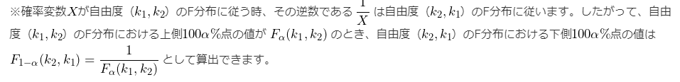

# 28. 等分散性の検定とWelchのt検定
## `F分布`

* 自由度が`k1`、`k2`のカイ二乗分布、が互いに独立である場合に、上記の式から算出されるFが従う確率分布のこと
  * Fは自由度(k1, k2)の`F分布`に従う
* t分布やカイ二乗分布と同様、自由度によって形が異なる分布だが、t分布やカイ二乗分布と異なり2つの自由度から分布の形が決まる

  

* 自由度が`k1`、`k2`のときの`F分布の確率密度関数`
* Γ(): ガンマ関数
* B(): ベータ関数
* **覚える必要なし**

* 正規分布に従う2つの母集団が従う確率変数N(μ, σ^2)における不偏分散sと母平均σ
* 母分散が等しいと仮定できる時、`s^2(1)/s^2(2)`となる
  * 帰無仮説を「2標本の母分散は等しい」とした場合に、2標本の不偏分散を用いて母分散が等しいかどうかを検定する`「等分散性の検定」`に使われる
* Fは自由度`(n1-1, n2-1)`のF分布に従う

* F分布の形
* df: 自由度

  

* 期待値と分散
* m, n: 自由度

### t分布とF分布の関係
  

* Z: 標準正規分布N(0, 1)に従うZ
* W: 自由度nのカイ二乗分布
* ZとWが互いに独立であるとき、上記の式の`t`は自由度nのt分布に従う
  * この時、`t^2`は自由度(1,n)のF分布に従う

## `F分布表`

* F分布表はいくつかのαの値ごとに作成されている

## 母分散の比の信頼区間の求め方
1. 統計量Fを計算する
2. 使用するF分布の自由度を決める
3. F分布表から該当する値を調べる(両側検定)
4. 100α%信頼区間を求める

  

* 確率変数`X`が自由度`(k1,k2)`のF分布に従う時、その逆数である`1/X`は自由度`(k2,k1)`のF分布に従う

## `Welchのt検定`
2標本t検定を行う場合、前提条件の1つとして「2つの母集団の分散が等しいこと」が必要

1. `等分散性の検定`で2標本の母分散が等しいかどうか検定
2. 等分散ではないとは言えない場合（帰無仮説`H0`「2標本の母分散は等しい」が棄却されない場合）はt検定
3. 等分散ではないと言える場合（帰無仮説`H0`「2標本の母分散は等しい」が棄却される場合）は`Welchのt検定`

最近では最初から等分散かどうかを考慮する必要のない「Welchのt検定」を行ったほうが良いという考え方も一般的になりつつある  

* `Welchのt検定`における統計量tの算出式
* x(bar): 1群目の標本平均
* n: サンプルサイズ
* s^2: 不偏分散

* 自由度を算出できる近似式
  * 自由度が整数でなくなる場合あり
* 覚える必要なし

### 多重性の問題
* 検定を複数回行うと、`第1種の過誤`の確率が大きくなる

母分散とサンプルサイズから不偏分散を求める方法