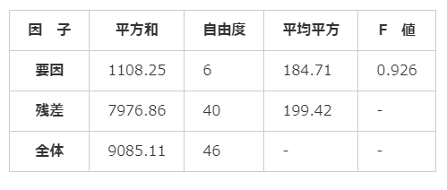
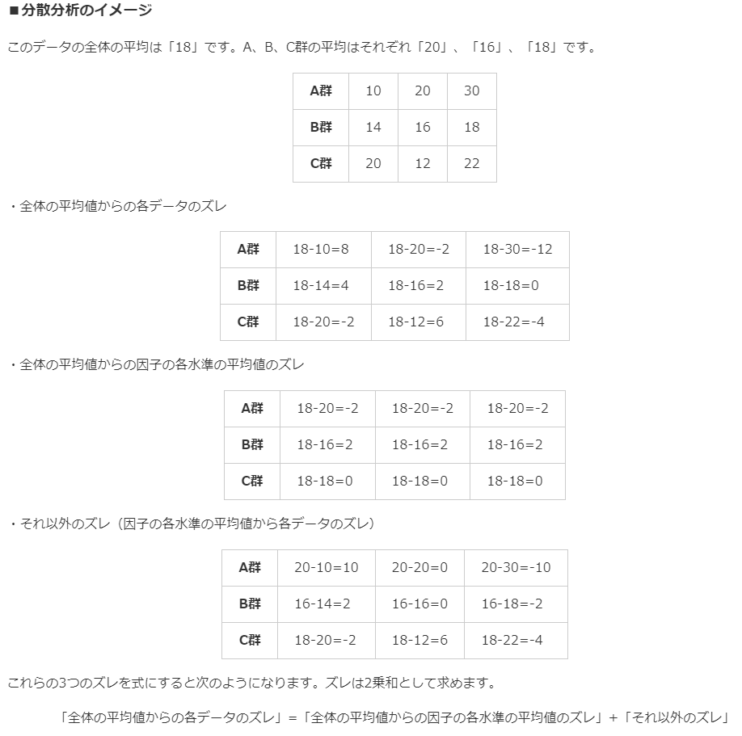

# 29. 一元配置分散分析
## 分散分析とは
* 3群以上からなるデータ（例えば1組、2組、3組の算数のテスト等）や1つのデータに2つの要素を含むデータ（薬A、B、Cをそれぞれ10mg、20mg投与した場合の効果等）の母平均の差を検定するもの
* データの`分散`をもとにした分析方法
* 群ごとのデータのばらつきを元に、`F分布`を用いて検定を行う

* 上記のような`分散分析表`を作成する
  * 帰無仮説`H0`は「各群の母平均は等しい」

### 分散分析の用語
* `要因`：データの値に変化を与える要素のこと
  * 算数のテストの場合、「組」以外に「その日の体調」や「気温」、「テスト時間」など様々なものが含まれる
* `因子`：要因の中でも特に、母平均に差をもたらすと考えられることから研究対象となる（あるいは注目する）要因を指す
* `水準`：1つの要因に含まれる項目（グループ）のこと
  * 算数のテストの場合「組」の水準は「1組、2組、3組」の3つであり、水準数は「3」となる
* `◯元配置`：データに含まれる因子の数を表すもの
  * 1組、2組、3組の算数のテストのデータの場合、含まれる因子の数は「組」のみであることから`一元配置のデータ`となる

### 分散分析の種類
* `一元配置分散分析`：1つの因子からなるデータを分析する方法で、因子に含まれる水準間の平均値の差を見ることができます
  * ある学校の1組、2組、3組の算数のテストのデータがある場合、一元配置分散分析を用いて、1組、2組、3組の算数のテストの平均点に差があるかどうかを検定できます
* `二元配置分散分析`：2つの因子からなるデータを分析する方法で、各因子における水準間の平均値の差を見ることができます。また、2つの要因が組み合わさることで現れる相乗効果の有無の確認もできます
  * 薬A、B、Cをそれぞれ10mg、20mg投与した場合の効果についてのデータがある場合、二元配置分散分析を用いて薬の種類によって得られる平均値に差があるか、あるいは薬の投与量によって得られる平均値に差があるかどうかを検定できます
* 多元配置分散分析：3つ以上の因子からなるデータを分析する方法です。

## 一元配置分散分析の流れ
* 分散分析のポイントは`「データ全体の平均値から因子の各水準の平均値がどのくらいずれているか」`を見ること
  * 下記3つに分けて考える
  * データ全体の平均値からの各データのズレ
  * データ全体の平均値からの因子の各水準の平均値のズレ
  * それ以外のズレ（因子の各水準の平均値からの各データのズレ）
  * **「全体の平均値からの各データのズレ」=「全体の平均値からの因子の各水準の平均値のズレ」+「それ以外のズレ」**
    * ズレは二乗和として求める

### 分散分析のイメージ

## 分散分析表の作成
| 因子 | 平方和 | 自由度 | 平均平方 | F値 |
| :-: | :-: | :-: | :-: | :-: |
| 要因 | 下記参照 | 因子の水準数 - 1 | 平方和 ÷ 自由度 | 下記参照 |
| 残差 | 下記参照 | `全体` - `要因` | 平方和 ÷ 自由度 | - |
| 全体 | 下記参照 | サンプルサイズ - 1 | - | - |

### `平方和`列
#### `要因`
* データ全体の平均値からの因子の各水準の平均値のズレ
* 全体の平均値と各群の平均値との差を二乗したものに、各群のデータ数をかけたものの和
  * Σ (μ - X(bar))^2 × n
    * X(bar): 各群の平均値
    * n: 各群のデータ数

#### `残差`
* `全体` - `要因`

#### `全体`
* データ全体の平均値からの各データのズレ
* 全体の平均値とすべてのデータとの差の二乗和を求める
  * Σ (μ - x)^2
  * μ: 母平均

### `F値`
* `要因の平均平方 ÷ 残差の平均平方`(比)
  * 分散分析ではこのF値を用いて検定を行う
  * F分布を用いる

## 統計量Fによる検定
* `残差のばらつき`に対する`要因のばらつき`が相対的に大きいかを検定する
  * 大きい: 要因による効果は有意である
  * 小さい: 要因による効果は有意であるとはいえない
* 大きいかどうかを見ればいいだけなので、必ず`片側検定`を行う

## 各水準の母平均の信頼区間

* 分散分析における各水準の母平均の信頼区間の算出式
* xj(bar): 水準jの標本平均
* df(E): 残差の自由度
* V(E): 残差の平方平均
* nj: 水準jのサンプルサイズ