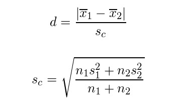
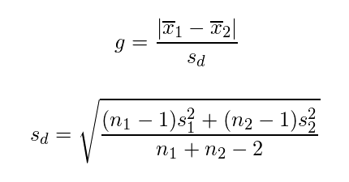

# 31. 実験計画
## フィッシャーの3原則
R.A. Fisherが実験計画法に関して確立した3つの原則
* 反復（replication）
  * 複数の処理を比較する際に、それぞれの処理に対して同じ条件で2回以上の繰り返し実験（評価）を行うこと
  * 測定値の違いが、`系統誤差（処理の違いによる差）`なのか`偶然誤差（たまたま生じる誤差）`なのか判断するため
* 無作為化（randomization）
  * 実験の順序や場所などが複数ある場合に、比較したい処理群を無作為に（ランダムに）割り付けること
* 局所管理（local control）
  * 実験を行う時間や場所を区切ってブロックを作り、そのブロック内でのバックグラウンドができるだけ均一になるように管理すること
  * 系統誤差を小さくすることができる

### 乱塊法
フィッシャーの3原則をすべて盛り込んだ実験デザインのこと

## 効果量
* その実験の効果を見るための指標
  * `検出したい差の程度`や`変数間の関係の強さ`のこと
* P値はサンプルサイズが大きいほど小さくなる(`中心極限定理`)ので、サンプルサイズによらない効果を示す指標が必要
* 様々な指標があるが、大別すると`d族`と`r族`がある
  * `d族`: 差の大きさを表すもの
    * `Cohenのd`
    * `Hedgesのg`
      * 上記は2つの標本間の平均値の差を標準偏差で割って標準化したもの
      * 2標本の平均値の差を比較する際に使う
      * 2標本の平均値がどれだけ離れているかを表す
  * `r族`: 相関の強さを表すもの

* `Cohenのd`
  * x1(bar): 1群目の標本平均
  * n1: 1群目のサンプルサイズ
  * s1^2: 1群目の分散

* `Hedgesのg`

* 上記効果量の値が大きい = 2つの標本における平均値が離れている(実験の効果が大きかった)

## 検出力

* 帰無仮説`H0`が正しくないときに、正しく`H0`を棄却する確率(`1-β`)
* 検出力が小さい場合、本当は`H1`が正しいのに`H0`と判断される可能性が高いことから、結果を信用することはできなくなる
  * 第2種の誤りを犯す可能性が高くなる
* 多くの場合、検出力を0.8に設定する
  * 80％の確率で、有意差があるときにそれを正しく検出できる
* 検出力は`効果量`や`サンプルサイズ`、`有意水準`が大きいほど大きくなる
* 検出力 = 棄却点以上の値を取る確率
  * 棄却点: 統計量Z等が分布図の該当する値を取る時の標本平均？

## サンプルサイズの設計と検出力分析
* 信頼性の高い実験を行うために実験の前後で行う分析のこと
* 以下が4大因子で、3つの因子の値が決まると残りの1つの因子の値が決まる
  * 有意水準
    * 0.05もしくは0.01が多い
  * 検出力
    * 通常0.8に設定される
  * サンプルサイズ
  * 効果量

### 事前分析（A priori）－サンプルサイズの設計

* 実験前に、検出したい差（＝効果量）から最適なサンプルサイズを算出すること
* 実際に算出する必要があるのは効果量のみ
  * 効果量が大きい場合には標本サイズは小さくてよく、一方で効果量が小さい場合には標本サイズは大きくなければならない

### 事後分析（post hoc）－検出力分析

* 実験後に、その実験によってどの程度の効果があったのかを知るため行う分析のこと
* P値が真に効果があったためのものなのか否かという本来のもつ意味を知ることができます